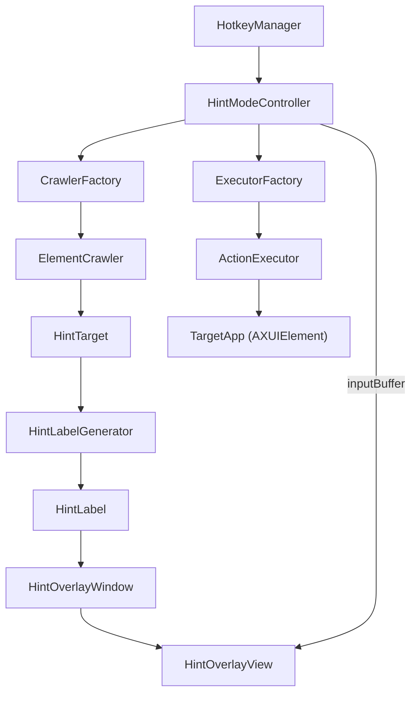
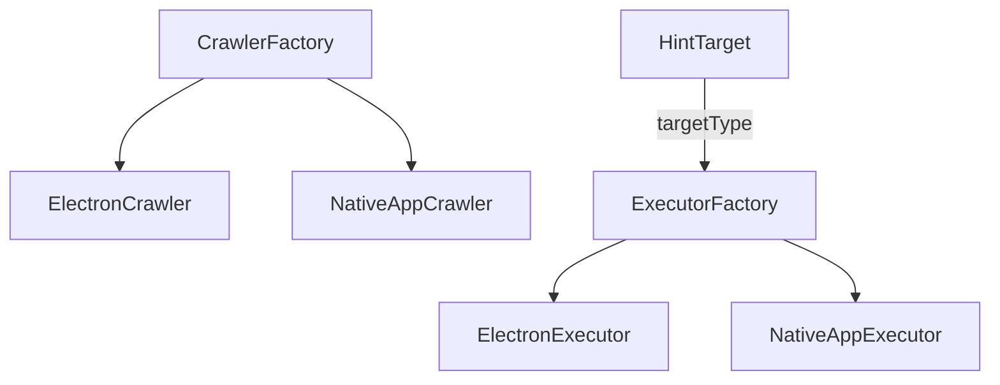
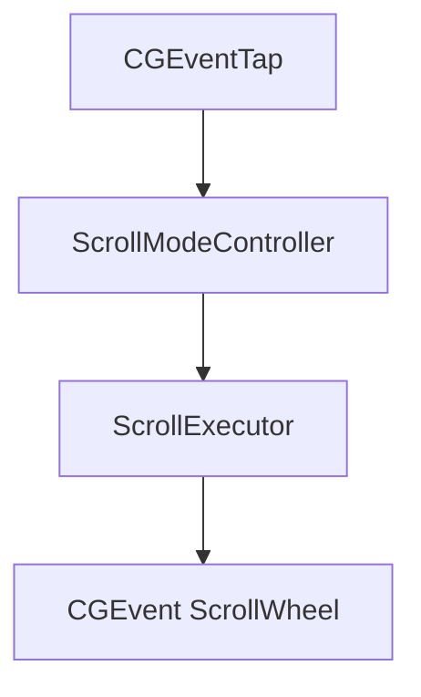
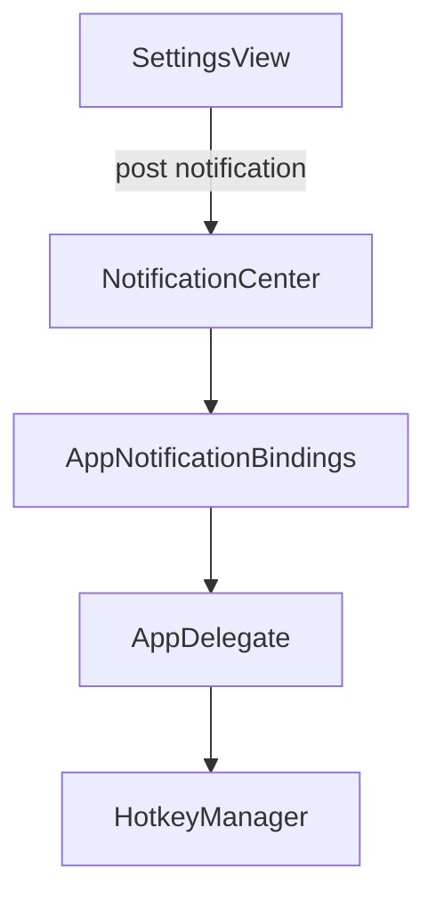

# Architecture

## 目的
PortalはmacOS向けVimiumライクなキーボードナビゲーションツール。Accessibility APIを使って
フロントアプリのUI要素を走査し、ヒントラベルをオーバーレイ表示して実行する。

## 前提と技術
- SwiftUI + AppKit混在（メニューバーアプリ、設定ウィンドウ、SwiftUIオーバーレイ）
- Accessibility API（`AXUIElement`）を利用
- macOS 15+（Sequoia）

## ディレクトリ構成（主要）
- `App/PortalApp.swift`: エントリポイント（メニューバーアプリ起動）
- `App/AppDelegate.swift`: ステータスバー、ホットキー、権限監視、設定ウィンドウ
- `Features/HintMode/UI/`, `Features/HintMode/Input/`, `Features/HintMode/Execution/`: ヒントモード
- `Core/Automation/Crawlers/`, `Core/Automation/Executors/`: 要素発見とアクション実行のStrategy/Factory
- `Features/ScrollMode/`: h/j/k/lスクロール
- `Infrastructure/Services/Accessibility/`, `Infrastructure/Services/Hotkey/`, `Infrastructure/Services/Electron/`: 権限、アクセシビリティ補助、Electron検出
- `Features/Settings/`: ホットキー、除外アプリ、走査深度、UI
- `Core/Models/`: HintTarget等のドメインモデル
- `Contracts/`: 抽象化の境界（protocols）

## ランタイム構成
### エントリポイント
`App/PortalApp.swift`が`@main`として起動し、`AppDelegate`を`NSApplicationDelegateAdaptor`で連携。
Dockに出さないメニューバーアプリとして動作し、可視ウィンドウは持たない。
```
@main
struct PortalApp: App {
    @NSApplicationDelegateAdaptor(AppDelegate.self) var appDelegate

    var body: some Scene {
        WindowGroup {
            EmptyView()
                .frame(width: 0, height: 0)
        }
        .windowResizability(.contentSize)
        .windowStyle(.hiddenTitleBar)
    }
}
```
[Portal/App/PortalApp.swift](../Portal/App/PortalApp.swift)

### AppDelegateの責務
- ステータスバー項目とメニュー生成
- アクセシビリティ権限の監視と表示状態の切替
- ホットキー管理の起動/再作成
- Scroll Modeの起動
- 設定ウィンドウの開閉
- NotificationCenterイベントの集約
```
func applicationDidFinishLaunching(_ notification: Notification) {
    setupStatusItem()

    if !TestConfiguration.shouldSkipAccessibilityCheck {
        checkAccessibilityPermission()
        if !AccessibilityService.isGranted {
            startPermissionCheckTimer()
        }
    }

    wasPermissionGranted = AccessibilityService.isGranted
    setupHintModeHotkeyManager()
    setupScrollMode()
    notificationBindings.start { [weak self] event in
        self?.handleAppNotificationEvent(event)
    }
}
```
[Portal/App/AppDelegate.swift](../Portal/App/AppDelegate.swift)

## Hint Mode（ヒント表示と実行）
### 概要
ヒントモードは`HintModeController`が中核。アクティブアプリのUI要素を走査し、
ヒントラベルを生成して`HintOverlayWindow`/`HintOverlayView`で描画する。
入力は`CGEventTap`で捕捉し、条件一致した要素を`Executor`で実行する。
```
func activate(for app: NSRunningApplication? = nil) {
    guard !isActive else { return }

    targetApp = app ?? getFrontmostApp()
    guard let targetApp else { return }

    Task {
        await performActivation(for: targetApp)
    }
}
```
[Portal/Features/HintMode/Input/HintModeController.swift](../Portal/Features/HintMode/Input/HintModeController.swift)

### 主要コンポーネント
- `HintModeController`: ライフサイクル管理、入力処理、実行
- `CrawlerFactory`/`ElementCrawler`: UI要素の探索
- `ExecutorFactory`/`ActionExecutor`: 要素へのアクション実行
- `HintLabelGenerator`: ラベル生成と絞り込み
- `HintOverlayWindow`/`HintOverlayView`: オーバーレイ描画

### フロー


### 進行中の走査（プログレッシブレンダリング）
`crawlElementsStream`を使い、発見した要素を逐次`HintLabel`化して描画。
ユーザーは走査途中でも入力が可能で、`ESC`でキャンセル可能。
```
crawlTask = Task {
    do {
        for try await target in crawler.crawlElementsStream(app) {
            if Task.isCancelled { break }

            let label = HintLabelGenerator.generateLabel(at: labelIndex)
            labelIndex += 1

            let hintLabel = HintLabel(
                label: label,
                frame: adjustedFrame,
                target: target,
                coordinateSystem: coordinateSystem
            )

            hints.append(hintLabel)
            for window in overlayWindows {
                window.addHint(hintLabel)
            }
        }
    } catch {
        // debug log
    }
}
```
[Portal/Features/HintMode/Input/HintModeController.swift](../Portal/Features/HintMode/Input/HintModeController.swift)

### ラベル生成と入力マッチ
`HintLabelGenerator`は2文字ラベル（例: AA, AB）を生成。
入力は部分一致でフィルタされ、唯一一致した時点で実行する。
```
static func generateLabel(at index: Int) -> String {
    guard index >= 0 else { return "" }

    let alphabetCount = alphabet.count
    let first = index / alphabetCount
    let second = index % alphabetCount

    guard first < alphabetCount else {
        return "Z\(index)"
    }

    return String(alphabet[first]) + String(alphabet[second])
}
```
[Portal/Features/HintMode/Execution/HintLabelGenerator.swift](../Portal/Features/HintMode/Execution/HintLabelGenerator.swift)

## Crawlers / Executors
### Strategy + Factory
`CrawlerFactory`と`ExecutorFactory`が対象アプリ種別に応じて実装を選ぶ。
```
func crawler(for app: NSRunningApplication) -> ElementCrawler {
    for crawler in crawlers {
        if crawler.canHandle(app) {
            return crawler
        }
    }
    return defaultCrawler
}
```
[Portal/Core/Automation/Crawlers/CrawlerFactory.swift](../Portal/Core/Automation/Crawlers/CrawlerFactory.swift)

```
func executor(for target: HintTarget) -> ActionExecutor {
    switch target.targetType {
    case .native:
        return nativeExecutor
    case .electron:
        return electronExecutor
    }
}
```
[Portal/Core/Automation/Executors/ExecutorFactory.swift](../Portal/Core/Automation/Executors/ExecutorFactory.swift)



### NativeAppCrawler
- `AXUIElement`のツリーを再帰走査
- `CrawlConfiguration`の`maxDepth`で深さ制御
- ウィンドウ複数対応（メイン + ポップアップ/メニュー）
- 取得できないフレームは`AccessibilityHelper.getFrameWithFallback`で補完
```
func crawlElements(_ app: NSRunningApplication) async throws -> [HintTarget] {
    guard AccessibilityService.isGranted else {
        throw NativeAppCrawlerError.accessibilityNotGranted
    }

    cachedMaxDepth = CrawlConfiguration.load().maxDepth

    let pid = app.processIdentifier
    let axApp = AXUIElementCreateApplication(pid)

    let windows = getAllWindows(from: axApp)
    guard !windows.isEmpty else {
        throw NativeAppCrawlerError.mainWindowNotAccessible
    }

    // ... crawl window trees ...
}
```
[Portal/Core/Automation/Crawlers/NativeAppCrawler.swift](../Portal/Core/Automation/Crawlers/NativeAppCrawler.swift)

### ElectronCrawler
- `ElectronAppDetector`でElectron判定
- `AXWebArea`を中心にWebコンテンツを走査
- ネイティブクロームは`NativeAppCrawler`で補完
- 座標系はElectron用（Y反転なし）
```
func canHandle(_ app: NSRunningApplication) -> Bool {
    return detector.isElectronApp(app)
}

func crawlElements(_ app: NSRunningApplication) async throws -> [HintTarget] {
    guard AccessibilityService.isGranted else {
        throw NativeAppCrawlerError.accessibilityNotGranted
    }

    let pid = app.processIdentifier
    let axApp = AXUIElementCreateApplication(pid)

    enableAccessibility(for: axApp)

    // ... crawl web areas and native chrome ...
}
```
[Portal/Core/Automation/Crawlers/ElectronCrawler.swift](../Portal/Core/Automation/Crawlers/ElectronCrawler.swift)

### NativeAppExecutor
Accessibility APIアクション（`AXPress`, `AXSelect`）の優先度実行。
対応できない場合はマウスクリックへフォールバック。
```
func execute(_ target: HintTarget) -> Result<Void, HintExecutionError> {
    guard target.isEnabled else {
        return .failure(.targetDisabled)
    }

    let elementIsValid = isElementValid(
        target.axElement,
        expectedTitle: target.title,
        validRoles: Self.validRoles
    )
    if !elementIsValid {
        return .failure(.elementInvalid)
    }

    for action in Self.preferredActions {
        let result = AXUIElementPerformAction(target.axElement, action as CFString)
        if result == .success {
            return .success(())
        }
    }

    if performMouseClick(on: target.axElement) {
        return .success(())
    }

    return .failure(.actionFailed(-1))
}
```
[Portal/Core/Automation/Executors/NativeAppExecutor.swift](../Portal/Core/Automation/Executors/NativeAppExecutor.swift)

### ElectronExecutor
AXUIElementの不安定性に対応。失敗時は`cachedFrame`を使ったクリックで実行。
```
func execute(_ target: HintTarget) -> Result<Void, HintExecutionError> {
    guard target.isEnabled else {
        return .failure(.targetDisabled)
    }

    let elementIsValid = isElementValid(
        target.axElement,
        expectedTitle: target.title,
        validRoles: Self.validRoles
    )

    if !elementIsValid {
        if let cachedFrame = target.cachedFrame,
           performMouseClickAtFrame(cachedFrame) {
            return .success(())
        }
        return .failure(.elementInvalid)
    }

    // ... try AX actions, then fallback to cachedFrame ...
}
```
[Portal/Core/Automation/Executors/ElectronExecutor.swift](../Portal/Core/Automation/Executors/ElectronExecutor.swift)

## Scroll Mode
`ScrollModeController`が`CGEventTap`で`h/j/k/l`を捕捉し、
`ScrollExecutor`が`CGEvent`のスクロールイベントを生成して送出する。
```
private func startEventTap() {
    let eventMask = (1 << CGEventType.keyDown.rawValue)
    let userInfo = Unmanaged.passUnretained(self).toOpaque()

    guard let tap = CGEvent.tapCreate(
        tap: .cgSessionEventTap,
        place: .headInsertEventTap,
        options: .defaultTap,
        eventsOfInterest: CGEventMask(eventMask),
        callback: { _, type, event, userInfo -> Unmanaged<CGEvent>? in
            guard let userInfo else { return Unmanaged.passRetained(event) }
            let controller = Unmanaged<ScrollModeController>.fromOpaque(userInfo).takeUnretainedValue()
            let keyCode = event.getIntegerValueField(.keyboardEventKeycode)
            let flags = event.flags

            let shouldConsume = controller.shouldConsumeEvent(keyCode: keyCode, flags: flags)
            if shouldConsume {
                Task { @MainActor in
                    controller.handleKeyEvent(keyCode: keyCode)
                }
                return nil
            }

            return Unmanaged.passRetained(event)
        },
        userInfo: userInfo
    ) else {
        return
    }

    eventTap = tap
    runLoopSource = CFMachPortCreateRunLoopSource(kCFAllocatorDefault, tap, 0)
    if let source = runLoopSource {
        CFRunLoopAddSource(CFRunLoopGetCurrent(), source, .commonModes)
    }
    CGEvent.tapEnable(tap: tap, enable: true)
}
```
[Portal/Features/ScrollMode/ScrollModeController.swift](../Portal/Features/ScrollMode/ScrollModeController.swift)

```
func scroll(direction: ScrollDirection) {
    let (deltaX, deltaY) = calculateDelta(for: direction)
    guard let scrollEvent = CGEvent(
        scrollWheelEvent2Source: nil,
        units: .pixel,
        wheelCount: 2,
        wheel1: deltaY,
        wheel2: deltaX,
        wheel3: 0
    ) else {
        return
    }

    if let location = getActiveWindowCenter() {
        scrollEvent.location = location
    }

    scrollEvent.post(tap: .cghidEventTap)
}
```
[Portal/Features/ScrollMode/ScrollExecutor.swift](../Portal/Features/ScrollMode/ScrollExecutor.swift)



### 競合回避
- Hint Modeが有効中はScroll Modeを無効化
- テキスト入力フォーカス中はスクロールをパススルー
```
private nonisolated func shouldConsumeEvent(keyCode: Int64, flags: CGEventFlags) -> Bool {
    let modifiersExceptShift: CGEventFlags = [.maskCommand, .maskControl, .maskAlternate]
    if !flags.intersection(modifiersExceptShift).isEmpty {
        return false
    }

    guard ScrollKey.from(keyCode: keyCode) != nil else {
        return false
    }

    if HintModeController.shared.isActive {
        return false
    }

    if AccessibilityHelper.isTextInputElementFocused() {
        return false
    }

    return true
}
```
[Portal/Features/ScrollMode/ScrollModeController.swift](../Portal/Features/ScrollMode/ScrollModeController.swift)

## Services / Settings / Notifications
### AccessibilityService
`AXIsProcessTrusted`で権限チェック、`AXIsProcessTrustedWithOptions`でダイアログ提示、
`openAccessibilitySettings`で設定画面へ誘導。
```
static var isGranted: Bool {
    AXIsProcessTrusted()
}

static func requestPermission() {
    let options = [
        kAXTrustedCheckOptionPrompt.takeUnretainedValue() as String: true
    ] as CFDictionary
    _ = AXIsProcessTrustedWithOptions(options)
}

static func openAccessibilitySettings() {
    guard let url = URL(
        string: "x-apple.systemsettings:com.apple.preference.security?Privacy_Accessibility"
    ) else {
        return
    }
    NSWorkspace.shared.open(url)
}
```
[Portal/Infrastructure/Services/Accessibility/AccessibilityService.swift](../Portal/Infrastructure/Services/Accessibility/AccessibilityService.swift)

### Settings
`SettingsView`で以下を管理し、`NotificationCenter`で変更通知を送信。
- ホットキー（`HotkeyConfiguration`）
- 除外アプリ（`ExcludedAppsConfiguration`）
- 走査深度（`CrawlConfiguration`）
```
private func notifyHotkeyChanged() {
    NotificationCenter.default.post(name: .hotkeyConfigurationChanged, object: nil)
}

private func notifyCrawlConfigChanged() {
    NotificationCenter.default.post(name: .crawlConfigurationChanged, object: nil)
}
```
[Portal/Features/Settings/SettingsView.swift](../Portal/Features/Settings/SettingsView.swift)

### 通知フロー


## 主要データモデル
### HintTarget
発見されたUI要素の最小表現。`AXUIElement`参照と`cachedFrame`を持つ。
Electronでは`cachedFrame`が重要。
```
struct HintTarget: Identifiable, @unchecked Sendable {
    let id: String = UUID().uuidString
    let title: String
    let axElement: AXUIElement
    let isEnabled: Bool
    let cachedFrame: CGRect?
    let targetType: HintTargetType
}
```
[Portal/Core/Models/HintTarget.swift](../Portal/Core/Models/HintTarget.swift)

### HintLabel
UI上に表示するラベル。`HintTarget`に紐付けて操作対象を特定。
```
struct HintLabel: Identifiable {
    var id: String { label }
    let label: String
    let frame: CGRect
    let target: HintTarget
    let coordinateSystem: HintCoordinateSystem
}
```
[Portal/Features/HintMode/UI/HintLabel.swift](../Portal/Features/HintMode/UI/HintLabel.swift)

### HintTargetType
`.native` / `.electron` を持ち、`ExecutorFactory`の選択に使う。
```
enum HintTargetType: Equatable, Sendable {
    case native
    case electron
}
```
[Portal/Core/Models/HintTargetType.swift](../Portal/Core/Models/HintTargetType.swift)

## スレッド/Actorルール
- Accessibility APIはMainActorで実行（`@MainActor`指定）
- `CGEventTap`のコールバックは非同期にMainActorへディスパッチ
- クロススレッド参照は`nonisolated(unsafe)`で読み取り専用に限定
```
@MainActor
final class HintModeController {
    nonisolated(unsafe) private(set) var isActive: Bool = false
    nonisolated(unsafe) private var eventTap: CFMachPort?
    // ...
}
```
[Portal/Features/HintMode/Input/HintModeController.swift](../Portal/Features/HintMode/Input/HintModeController.swift)

## エラーとフォールバック
- 権限未付与: `AccessibilityService`で検出し、UIで案内
- AXUIElementが不正: `HintExecutionError.elementInvalid`
- Electron: `cachedFrame`クリックで代替実行
- CGEventTap失敗: Hotkeyはグローバル監視へフォールバック（消費不可）
```
enum HintExecutionError: Error, LocalizedError, Equatable {
    case elementInvalid
    case targetDisabled
    case actionFailed(Int32)
}
```
[Portal/Core/Models/HintExecutionError.swift](../Portal/Core/Models/HintExecutionError.swift)

```
guard let tap = CGEvent.tapCreate(
    tap: .cgSessionEventTap,
    place: .headInsertEventTap,
    options: .defaultTap,
    eventsOfInterest: CGEventMask(eventMask),
    callback: callback,
    userInfo: refcon
) else {
    startGlobalMonitorFallback()
    return
}
```
[Portal/Infrastructure/Services/Hotkey/HotkeyManager.swift](../Portal/Infrastructure/Services/Hotkey/HotkeyManager.swift)

## 既知の制約
- Accessibility APIの限界により一部UIが見えない
- ElectronアプリはDOM変更で要素が不安定
- 権限がない場合はイベントの消費ができず、OSショートカットと競合する可能性
